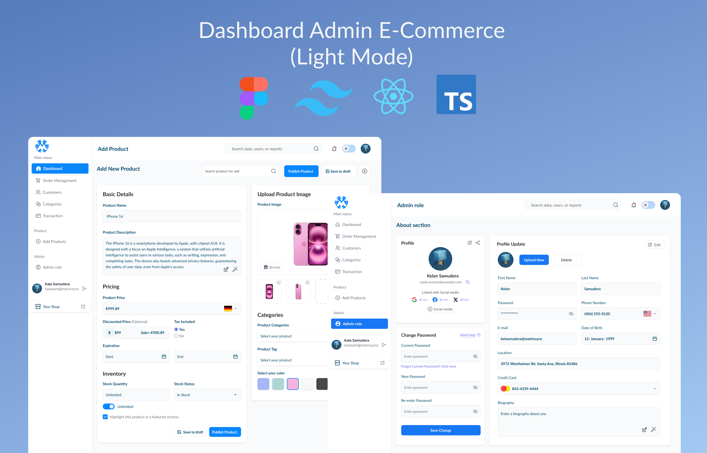

# 🛍️ Dashboard Admin E-Commerce (Light Mode)

Ini adalah proyek **Dashboard Admin E-Commerce** versi Light Mode yang dirancang untuk memudahkan pengelolaan data e-commerce seperti produk, pelanggan, transaksi, dan informasi admin. Dashboard ini dibangun dengan arsitektur modern dan UI profesional menggunakan:

- 🔷 Figma (desain UI)
- ⚛️ React
- 🟦 TypeScript
- 🌬️ Tailwind CSS

---

## ✨ Fitur Utama

- 📦 **Manajemen Produk**  
  Tambahkan produk lengkap dengan deskripsi, harga, status inventori, dan kategori.

- 👤 **Admin Role Section**  
  Update informasi profil admin seperti nama, email, password, lokasi, nomor telepon, dan kartu kredit.

- 📷 **Upload Gambar Produk**  
  Fitur unggah gambar dengan preview langsung.

- 🔎 **Pencarian dan Navigasi**  
  Sidebar dan search bar responsif untuk navigasi yang efisien.

---

## 🛠️ Tech Stack

| Tools        | Fungsi                                  |
|--------------|------------------------------------------|
| [Figma](https://figma.com)       | Desain dan prototyping UI |
| [React](https://reactjs.org/)    | Library frontend |
| [TypeScript](https://www.typescriptlang.org/) | Superset JavaScript |
| [Tailwind CSS](https://tailwindcss.com/)     | Framework utility-first CSS |

---

## 📁 Struktur Halaman

- `/dashboard` — Beranda utama admin
- `/add-products` — Form tambah produk
- `/admin-role` — Profil admin
- `/customers`, `/categories`, `/transactions` — Manajemen data

---

## 🖼️ Tampilan

---

## 👩🏻‍💻 Frontend Developer

**Malika Shakila**  
Lead Frontend Developer
📧 malika@msync.my.id 
🌐 [malikashkl](https://www.linkedin.com/in/malikashkl/)

**Aisyah Rahmawati**  
Frontend Developer
📧 aisyahr142@gmail.com
🌐 [aisyhrr](https://www.linkedin.com/in/aisyhrr/)

---

## 📌 Catatan

Versi ini hanya mendemokan tampilan (frontend). Integrasi API/backend belum tersedia.  
Untuk pengembangan selanjutnya, bisa ditambahkan:
- 🔐 Autentikasi
- 📊 Dashboard analytics
- 🌗 Mode gelap (dark mode toggle)

---

> Copyright by EkS-Commerce Team Project.
